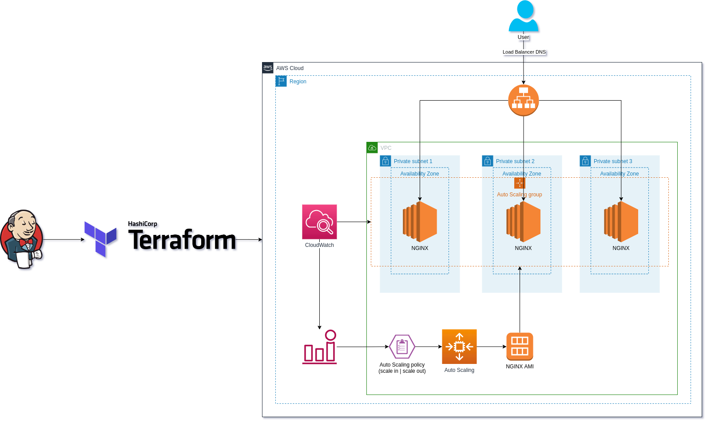

# aws-autoscaling-terraform
This project provides a comprehensive solution for the automated creation of an architecture on AWS, emphasizing high availability concepts and deployment pipeline. Through the integration of Jenkins and Terraform, this solution streamlines the implementation of a robust and scalable infrastructure. **For additional resources, examples, and community engagement**, check out the portal [Cloudymos](https://cloudymos.com) :cloud:.

With this infrastructure you'll use the following technologies:

* AWS Cloud Provider
* Terraform
* Jenkins
* AWS Steps Plugin

## Prerequisites

* Terraform installed
* AWS account 
* Jenkins pipeline with AWS Steps configured to authenticate to your aws account

## What will be created?

* VPC
* Private and Public subnets
* Auto scale group
* Cloud watch alarm and triggers
* Load Balancer
* EC2

Take a look at the architecture for more details: 

**Feel free to contribute with improvements, just make a pull request :bowtie:**
